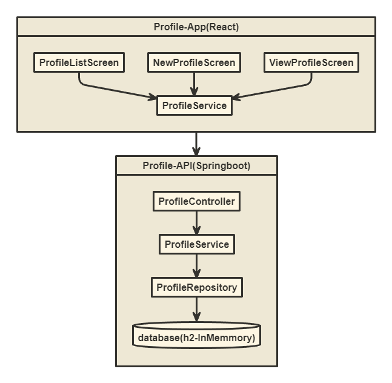
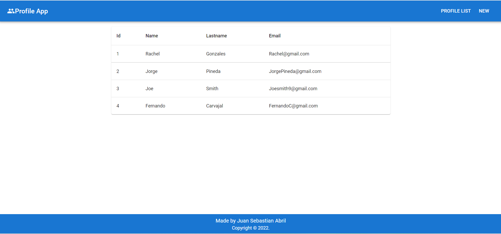
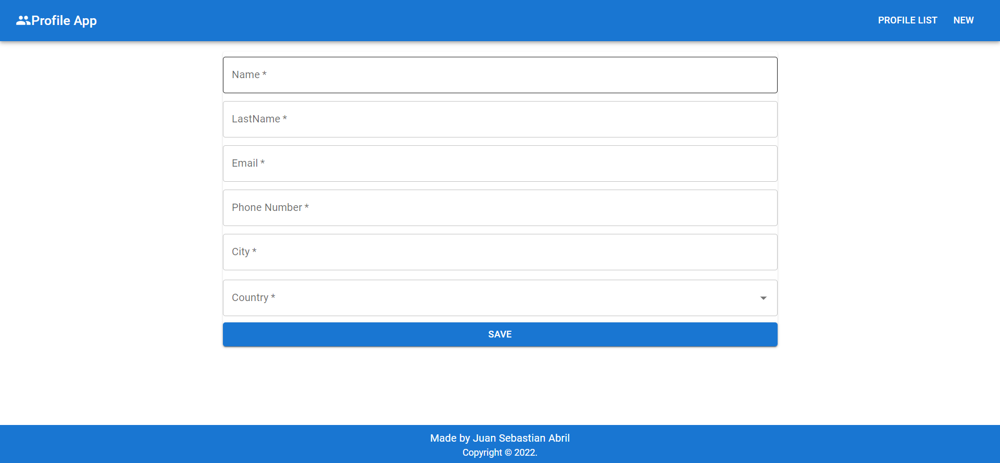

# Profile-App
Este genial projecto tiene una interfaz
con tres pantallas donde podras añadir nuevos Perfiles con su información personal(nombre, apellido, email, número telefónico, ciudad y país), ver todos los perfiles guardados y ver información detallada de cada uno. Profile-App usa React como framework en el Frontend junto con MaterialUI, y para el backend se usa Java con Springboot; JPA e Hibernate y h2 como base de datos en memoria.
  
## Arquitectura
Esta aplicación usa una arquitectura de capas que está dividida en dos: Frontend(Profile-App) y Backend(Profile-API)



### Frontend
El Frontend se construyo con una arquitectura de dos capas: Pantallas y Servicio.

- Pantallas: contiene las pantallas que componen la interfaz de usuario:

    - ProfileListScreen.
    
    - NewProfileScreen.
    
    - ViewProfileScreen.
    
    

- Servicios: contiene las funciones que nos permiten comunicar el Frontend con la Backend API:

    - getProfiles.
    - getProfileById.
    - createProfile.

#### Rutas
Las rutas establecidas con React Router son:

- "/": pantalla de inicio, también se puede llegar a `ProfileListScreen` clickeando en el botón "PROFILE LIST".

- "/new": pantalla para crear un nuevo Perfil, se llega a `NewProfileScreen` clickeando en el botón "NEW".

- "/profile/:id": pantalla para ver un Perfil, se llega a  `ViewProfileScreen` clickeando en una fila de la tabla en `ProfileListScreen`.

### Backend
El Backend Profile-API fue realizado con Springboot, tiene una arquitectura de 3 capas: controlador, servicio y repositorio. Se uso JPA con SpringData para la capa de repositorio y se usa h2 como base de datos en memoria.

- Profile: esta clase representa el model que contiene los siguientes atributos:

    - Nombre.
    - Apellidos.
    - Email.
    - Número de teléfono.
    - Ciudad.
    - País.

- ProfileController: esta clase expone los sigueintes endpoints:
    - Post("/profile")
    - Get("/profile")
    - Get("/profile/{id}")
- ProfileService: esta clase contiene las reglas de negocio con los siguientes métodos:  
    - createProfile
    - getProfiles
    - getProfileById
- ProfileRepository: es la capa de persistencia de datos que usa JPA.
- WebConfig: código que permite CORS.

## Instrucciones para correr el proyecto
Requisitos:
- Java 17
- Node 16

### Instrucciones para correr el backend:
 - Ve a la carpeta 'backend' y abre una nueva terminal (Gitbash si es Windows). Ejecuta el sigueinte comando:
 
    ```console
    ./gradlew bootRun
    ```

### instrucciones para correr  el frontend:

- Ve a la carpeta 'frontend' y abre una nueva terminal. Ejecuta los siguientes códigos en el orden propuesto:

    ```console
    npm install
    npm run start
    ```
-Abrir el navegador e ir http://localhost:3000/